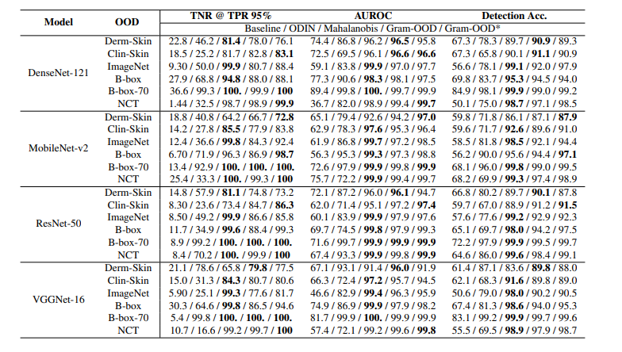

# SkinWise:  For diagnosis, treatment and research in dermatology

 

## Purpose 🎯
The Global Burden of Disease project has shown that skin diseases continue to be the 4th leading cause of nonfatal disease burden worldwide.Additionally, skin disorders pose a significant threat to patients' well-being, mental health, ability to function, and social participation. However, it is very difficult to provide better dermatological care to under-served or resource-poor regions in a cost-effective manner owing to unavailability of efficient diagnostic tools, lack of connectivity, and poor laboratory infrastructure etc. Moreover, there is also a scarcity of physicians with dermatological training. Even, preliminary screening of a dermatological manifestation seems to be an arduous task.

## What is SkinWise ? 👀
Introducing Skinwise, whether its a normal skin disease, or a life threatening one, our highly accurate models will provide you with perfect diagnosis and will help you get over the situation. 
We are your headquarters for dermatological preliminary diagnostics and treatment, with great diagnosis systems, we provide assistance & treatments using artificial intelligence for in-depth analysis and reports.
We are your key to healthy and happy skin.

## Features 🧠
- #### Osiris AI - Dermatological Preliminary Diagnosis:  
    Osiris AI pipeline will,
    - First ask you for the image of affected skin part, 
    - Then will ask you certain questions (such as your geographical region and any previous disorders etc.), 
    - Make use of 3D model to get precise location of your skin problem and 
    - Then provide prelimnary diagnosis
- #### Apollo AI -Personalized skin care:  
    A dedicated seciton for personal skin care problems such as Acne Papule, Blackheads, Fungal Acne, Milia, Perioral Dermatitis, Sun Spots. 
    SkinWise will recommend skin care routines according to problem. 
- #### Skin Care as per daily weather 
    Leveraging user's current location's weather conditions, SkinWise provides skin care routine for the day.
- #### Diagnostic reports for Dermatological Analysis
    Osiris AI pipeline generates a detailed diagnostic report which will include model confidences and suggested treatments. 
    This reports can be used by doctors, and physician to make further decisions. 
- #### Research section:
    3D model to understand layers of skin in depth and perform further study on them!

 

## SkinWise Multi-Model Architecture 🤖
- Image Recognition:  
Using VGG16 as the base model and weights from ImageNet, this model was trained with custom dataset.
After training for only 10 epochs (*remember it is transfer learning!*), the model predicts diseases with acc of 94%
The prediction from this model is then used further in the LLM

- Large Language Model:  
The prediction made by Image Recognition model is used by LLM to give respective cures.
We use recently released Llama 2 70B model by Meta AI.
The original model size is greater than 100GB which was Quantized to 3GB which means this model is deployable and has practical application not just for *research purposes*.  We fine-tuned the llm using [InstructorDoctor-200k](https://drive.google.com/u/0/uc?id=1lyfqIwlLSClhgrCutWuEe_IACNq6XNUt&export=download).
Also we are working with team of doctors to authenticate the outputs by LLM.

## Why use VGG-16 for transfer learning?
The paper [On Out-of-Distribution Detection Algorithms with Deep Neural Cancer Classifiers](https://openaccess.thecvf.com/content_CVPRW_2020/papers/w42/Pacheco_On_Out-of-Distribution_Detection_Algorithms_With_Deep_Neural_Skin_Cancer_Classifiers_CVPRW_2020_paper.pdf) provides a good comparitive study on which models to be used for skin disease predictions.

 

### Branch Overview
- main (Flutter Code)
- Backend (MongoDB Integrations)
- MachineLearning (Experiments with ML libraries and models)

## How to use the application? 📲
-  Clone the repository
- Install all the dependencies from pubspec.yaml
- And start building Flutter Application.

### *(Contact us for models, we cannot provide the models as of now due to ongoing copyright and patent process)* 

